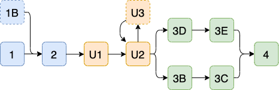

# Fashion2Events

## Datasets

Two datasets are required:
- DeepFashion2
- USED

### DeepFashion2
DeepFashion2 is available at this [GitHub repository](https://github.com/switchablenorms/DeepFashion2).
It contains all the information about the dataset, and the instructions to download the data.

You will need to fill in a form to get the password to unzip the files.
To train Mask R-CNN the dataset must be in the COCO format. DeepFashion2 authors provided a script to generate coco-type
annotations that can be found [here](https://github.com/switchablenorms/DeepFashion2/blob/master/evaluation/deepfashion2_to_coco.py) is provided.

### USED
The official USED web page can be found [here](http://loki.disi.unitn.it/~used/). The page contains the link to download
the data.

The downloaded data contains many txt files with annotations, however some of them seems to be useless (maybe they are old
and dirty files). Notebook U1 will consider only the useful ones.

## Notebooks
The following figure shows the order in which notebooks must be executed to train, check and evaluate the recommendation system:

### 1-Mask-RCNN-training
It performs the Mask R-CNN training on the DeepFashion2 dataset. The dataset must be in the COCO format.

### 1B-Mask-RCNN-training-multi-gpu
Variant of Notebook 1 to perform the training on multiple GPUs.

### 2-Mask-RCNN-evaluation
It evaluates a trained Mask R-CNN model on the test set using the COCO evaluation metrics. Results are stored in a JSON file.

### U1-USED-preprocessing
It creates a new dataset from USED made of images of isolated garments using Mask R-CNN.
It loads a trained Mask R-CNN and makes inference on the whole USED dataset, performing clothes detection,
classification and segmentation. For each detected garment it creates and save a new image containing the segmented part on
a black background. It also stores the image file paths, event class label and garment class label into csv files.

### U2-USED-pp-statistics
It calculates and plots statistics on the dataset generated by Notebook U1.

### U3-train-test-rebalancing
Notebook to be optionally used to rebalance test and train set of the dataset generated by Notebook U1. It moves images
from the csv test file to the csv train file.

### 3B-ResNet50-TL
It trains a pretrained ResNet50 model on the dataset generated by Notebook U1 to classify social events. The ResNet50 is
pretrained on ImageNet and the convolutional parts are kept frozen during training.

### 3C-ResNet50-FT
It loads the model trained in Notebook 3B, unfreeze the last convolutional part of the ResNet50 and resume the training process.

### 3D-ResNet50-Embedding-TL and 3E-ResNet50-Embedding-FT
Similar to Notebooks 3B and 3C, but they uses a ResNet50 classifier with an additional embedding layer (please refer to 
the [presentation](presentation.pdf) and the [report](report.pdf) for further information)

### 4-ResNet50-evaluation
It evaluates the classifiers trained in Notebooks 3X on the test dataset generated by Notebook U1.